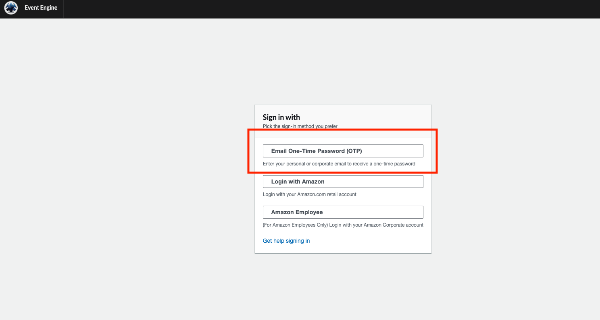
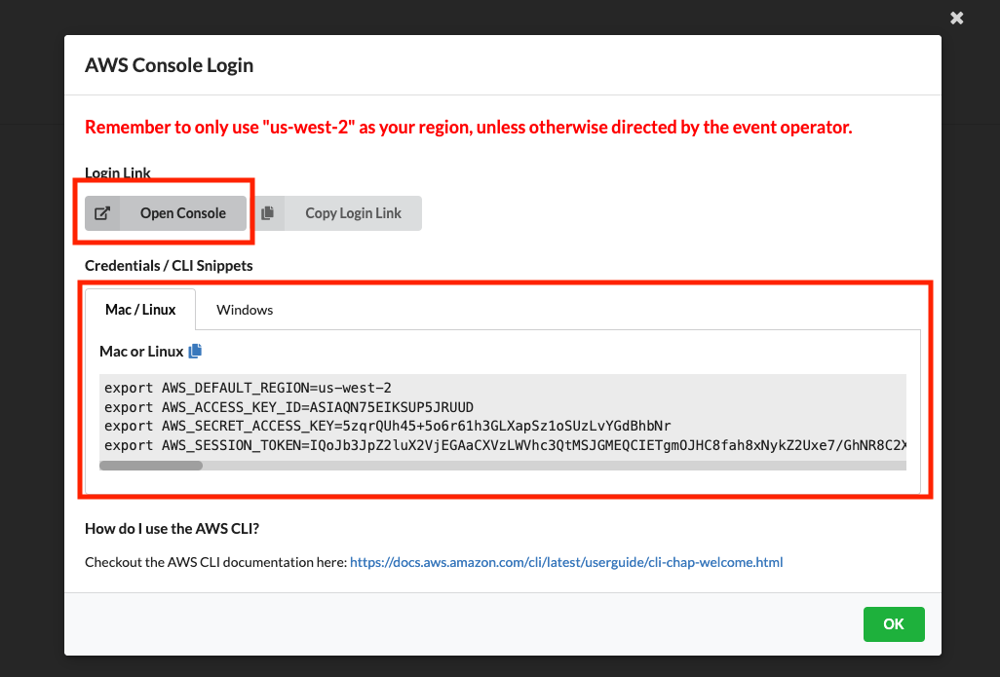
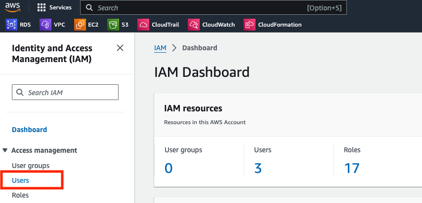

# Welcome!

This workshop will demonstrate how to leverage infrastructure as code (IaC) and DevSecOps patterns to automate, scale, and improve the security posture of cloud infrastructure and applications. We will create a pipeline that ensures our configurations are secure and compliant from code to cloud.

This guide provides step-by-step instructions to integrate **Prisma Cloud** (and **checkov**) with **Terraform Cloud, Github, VScode** and **AWS**. 


## Learning Objectives
- Gain an understanding of DevSecOps and infrastructure as code (IaC) using Terraform
- Scan IaC files for misconfigurations locally
- Set up CI/CD pipelines to automate security scanning and policy enforcement
- Fix security findings and AWS resource misconfigurations with Prisma Cloud

**Let’s start with a few core concepts...**

### DevSecOps
The foundation of DevSecOps lies in the DevOps movement, wherein development and operations functions have merged to make deployments faster, safer, and more repeatable. Common DevOps practices include automated infrastructure build pipelines (CI/CD) and version-controlled manifests (GitOps) to make it easier to control cloud deployments. By baking software and infrastructure quality requirements into the release lifecycle, teams save time manually reviewing code, letting teams focus on shipping features.

As deployments to production speed up, however, many traditional cloud security concepts break down. With the rise of containerized technologies, serverless functions, and IaC frameworks, it is increasingly harder to maintain visibility of cloud security posture. 

By leveraging DevOps foundations, security and development teams can build security scanning and policy enforcement into automated pipelines. The ultimate goal with DevSecOps is to “shift cloud security left.” That means automating it and embedding it earlier into the development lifecycle so that actions can be taken earlier. Preventing risky deployments is a more proactive approach to traditional cloud security that often slows down development teams with deployment rollbacks and disruptive fixes.

For DevSecOps to be successful for teams working to build and secure infrastructure, embracing existing tools and workflows is critical. At Palo Alto Networks, we’re committed to making it as simple, effective, and painless as possible to automate security controls and integrate them seamlessly into standard workflows.


### Infrastructure as Code Using Terraform
Infrastructure as code (IaC) frameworks, such as  HashiCorp Terraform, make cloud provisioning scalable and straightforward by leveraging automation and code. Defining our cloud infrastructure in code simplifies repetitive DevOps tasks and gives us a versioned, auditable source of truth for the state of an environment.

Terraform is useful for defining resource configurations and interacting with APIs in codified, stateful manor. Any updates we want to make, such as adding more instances, or changes to a configuration, can be handled by Terraform. 

For example, the following Terraform resource block defines a simple AWS S3 bucket:

```hcl
resource "aws_s3_bucket" "data" {
  bucket     = "my_bucket_name"
  acl        = "public-read-write"
}
```

After performing `terraform init`, we can provision an S3 bucket with the following command:

```bash
terraform apply
```

Any changes made to the resource definition within a .tf file, such as adding tags or changing the acl, can be pushed with the  `terraform apply` command. 

Another benefit of using Terraform to define infrastructure is that code can be scanned for  misconfigurations before the resource is created. This allows for security controls to be integrated into the development process, preventing issues from ever being introduced, deployed and exploited.


## Setup / Prerequisities
- Github account
- Terraform Cloud account
- AWS account (provided during workshop)
- Prisma Cloud account (OPTIONAL)

## Log into AWS Event Engine
*This section is for live workshop events only.*

Follow the link provided to you for Event Engine. Enter the event hash (if it is not already populated), and click `Accept Terms & Login`.


Choose your perferred sign-in method (OTP is recommended for workshop attendees).



Once logged in, copy the provided credentials into a local text file and then click `Open Console` to navigate to AWS.



## Configure IAM User and API Key
*Skip this section for workshops <100 attendees*

From the AWS console, select `IAM` or search for 'IAM' in the Search bar if not displayed.


In the IAM Dashboard, click `Users` on the left sidebar.



Click the `Create User` button on the top right.


Specify a `User name` that will be unique then click `Next`.


Next, set the permissions for the user by selecting `Attach policies directly` and attaching the `AdministratorAccess` policy.


Review the user details and click `Create user`.


Now we need to assign an API key to the user we just created. Click on the user you just created from the IAM Dashboard and then click `Create access key` on the right.


Select `Other` from the Access Key options.


Optionally, supply a tag to associate with the Access Key, then click `Create access key`.


Finally, save the Access Key data provided (copy to a local file). This credential will be used to deploy resources to AWS in a later section. When ready, click `Done`.


An access key will now appear on the User details page.


## Configure Cloud9
To ensure we all have the same environent configuration, we will use Cloud9, a cloud-delivered IDE from AWS, to carry out many of the steps in this workshop. To set this up, navigate back to the AWS Console home and select Cloud9 (or enter it into the Search bar).


On the Cloud9 Environments page, click `Create Environment`


Enter a `Name` for the Environemnt and select `New EC2 instance` for Environment Type.


Select `Additional instance types` then choose `t3.medium` from the drop-down.


Leave all other options on default setting and click `Create`. 


Once the environment is created, navigate to it and click `Open in Cloud9` to launch the IDE.


Close all of the Welcome default windows, then create a new Terminal window.


Congrats! Cloud9 is now ready to use. Before installing checkov or pulling code to scan, create and activate a python virtual environment to better organize python packages.

``` 
python3 -m venv env
source ./env/bin/activate 
```


##
# Section 1: Code Scanning with checkov

[Checkov](https://checkov.io) is an open source 'policy-as-code' tool that scans cloud infrastructure defintions to find misconfigurations before they are deployed. Some of the key benefits of Checkov 
1. runs as a command line interface (CLI) tool 
2. supports many common plaftorms and frameworks 
3. ships with thousands of default policies
4. works on windows/mac/linux (any system with python installed)

## Install checkov

To get started, install checkov using pip:

```
pip3 install checkov
```


Use the `--version` and `--help` flags to verify the install and view usage / optional arguements 

```
checkov --version
checkov --help
```


To see a list of every policy that Checkov can enforce, use the `-l` or ` --list` options.

```
checkov --list
```

Now that you see what checkov can do, let's get some code to scan...


## Fork and clone target repository
This workshop involves code that is vulnerable-by-design. All of the necessary code is contained within [this repository](https://github.com/paloAltoNetworks/prisma-cloud-devsecops-workshop) or workshop guide itself.

To begin, log into Github and navigate to the [Prisma Cloud DevSecOps Workshop](https://github.com/paloAltoNetworks/prisma-cloud-devsecops-workshop) repository. Create a `Fork` of this repositry to create a copy of the code in your own account.


Ensure the selected `Owner` matches your username, then proceed to fork the repository by clicking `Create fork`.


Grab the repo URL from Github, then clone the **forked** repository to Cloud9.


```
git clone https://github.com/<your-organization>/prisma-cloud-devsecops-workshop.git
cd prisma-cloud-devsecops-workshop/
git status

```


Great! Now we have some code to scan. Let's jump in...


## Scan with checkov
- -f, -d
- -skip, -check
- -framework
- -soft, -hard, exit codes and automation

## Custom Policies
- -external-checks-dir

## IDE plugin
*Demo Only. Requires API key for Prisma Cloud.*
- VScode extension
- CLI + API Key (severity, policy name)

## Integrate with Github Actions
- checkov
- yor
- results in GHAS
- terraform / TFC flow*
- BONUS: link to pre-commit hooks

## Integrate with Terraform Cloud
...

## Block a Pull Request, Prevent a Deployment
...

##
# Section 2: Application Security with Prisma Cloud
*This portion of the workshop is optional (or 'read-only') unless you have existing access to Prisma Cloud.*

## Integrations and Dashboards
- Checkov/GHA with API key (GHAS, severity, image scanning)
- TFC Run Tasks (streamlined output)
- Github Application (PR comments)
- Results in platform (for each)
    - Projects, IaC, Vulns/SCA, SBOM, CICD, etc.

## Issue a PR Fix
...

## Drift Detection
...
- seperate example

# Conclusion
- congrats! and review of material
- some call to action and links ... 


